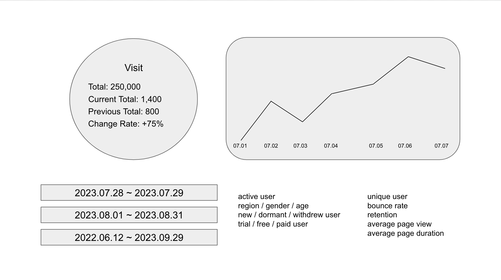

# ELK 스택을 활용해 통계성 데이터 제공하는 API 구현하기

# 0. 목차

* [요구조건 분석](#1-요구조건-분석)
* [기술 선택](#2-기술-분석)
* [구현 과정에서의 고민과 해결책](#3-고민과-해결책)

# 1. 요구조건 분석

## 1.1. 서비스 개요

SNS 와 같이 많은 사람들이 컨텐츠를 즐기며 서로 상호작용 하는 커뮤니티형 서비스라고 생각해보자.
(예시) 유튜브, 페이스북, 인스타그램

여기에는 크게 세 종류 이상의 도메인이 있다.
(1) 컨텐츠 - content
(2) 컨텐츠를 업로드하는 사용자 - uploader
(3) 컨텐츠를 즐기는 사용자 - viewer or visitor

### 1.2. Analytics API 요구조건

### 1.2.1. Page 1 - 사용자 관련 통계 정보

사용자 관련해서 다음과 같은 요구사항이 있다고 가정해보자.



(1) 통계 정보를 확인하려는 기간을 설정할 수 있다.

-> 시작 시점
-> 종료 시점
-> 조회 범위는 최대 1년으로 한정
-> 꺾은선 그래프의 X축 데이터는 사용자가 존재하는 timezone 기준으로 보여줘야 한다.

(2) 사용자 방문에 대한 통계 정보를 숫자로 확인하는 경우

-> 총 방문자 수 (total)
-> 현재 기간 내 총 방문자 수 (current total)
-> 이전 기간 내 총 방문자 수 (previous total)
-> 방문자 수 증감률 (change rate)

(3) 사용자 방문에 대한 통계 추이를 꺾은선 그래프로 확인하는 경우

-> 단위시간 별 방문자 수

(4) 사용자 관련해서는 다음과 같은 메트릭이 필요하다

기본적인 사용자 관련 메트릭은 다음과 같은 항목이 있다.

-> 활성 사용자 수 (active user)
-> 지역, 성별, 연령에 따른 사용자 수
-> 신규, 휴면, 탈퇴 사용자 수
-> 체험판 / 무료 / 구독 사용자 수

복잡한 사용자 관련 메트릭은 다음과 같은 항목이 있다.

-> 중복없는 사용자 수 (unique user)
-> 첫 페이지 이탈률 (bounce rate)
-> 재방문율 (retention)
-> 평균 방문 페이지 수 (average page view)
-> 평균 페이지에 머무른 시간 (average page duration)

### 1.2.2. Page 2 - 컨텐츠 관련 통계 정보

컨텐츠 관련홰서 다음과 같은 요구사항이 있다고 가정해보자.


(1) 통계 정보를 확인하려는 기간을 설정할 수 있다.

-> 시작 시점
-> 종료 시점
-> 조회 범위는 최대 1년으로 한정
-> 꺾은선 그래프의 X축 데이터는 사용자가 존재하는 timezone 기준으로 보여줘야 한다.

(2) 컨텐츠 조회수 통계 정보를 숫자로 확인하는 경우

-> 총 조회수 (total)
-> 현재 기간 내 총 조회수 (current total)
-> 이전 기간 내 총 조회수 (previous total)
-> 조회수 증감률 (change rate)

(3) 컨텐츠 조회수 통계 추이를 꺾은선 그래프로 확인하는 경우

-> 단위시간 별 컨텐츠 조회수

(4) 컨텐츠 관련해서 다음과 같은 메트릭이 필요하다.

기본적인 컨텐츠 관련 메트릭은 다음과 같은 항목이 있다.

-> 업로드 수
-> 조회수
-> 좋아요 수
-> 공유 횟수
-> 평균 시청 시간

컨텐츠 관련 메트릭은 다음 두 가지 항목에 대해서 수집해야 한다.

-> 컨텐츠 마다의 통계 정보
-> 카테고리 별 통계 정보

# 2. 기술 분석

## 2.1. ELK(Elasticsearch, Logstash, Kibana) 를 선택한 이유

처음에는 과거부터 데이터 분석 플랫폼으로 유명한 Hadoop, Spark 를 고려하기도 했지만 결국에는 Elasticsearch, LogStash, Kibana 를 선택헀다.

링크 1 - https://thecustomizewindows.com/2017/02/apache-hadoop-spark-vs-elasticsearch-elk-stack/

[ 이유 1 ]
분석 통계 서비스를 구현해야하는 서비스의 백엔드 메인언어가 NodeJS 인데
Hadoop-Spark 진영에서는 NodeJS Native API 를 제공하지 않고 있기 때문에
NodeJS 에서 사용하기에 보다 편리한 ELK 를 선택한다.

[ 이유 2 ]
Hadoop-Spark 에서 데이터를 저장하는 방식은 Wide-Column Database 이고
Elasticsearch 는 상대적으로 효율적인 Full-Text Search 가 가능한 Search Engine 이다.
API 구현하는 과정에서 search 와 aggregation 기능을 주로 사용하게 될 것 같아서 ELK 를 선택한다.

[ 이유 3 ]
제공하려는 서비스가 Big Data Processing 자체에 목적이 있다기 보다는
Analytics, Visualization 쪽에 가깝기 때문에
이쪽으로 계속해서 연구개발하고 있는 ELK 를 선택한다.

## 2.2. ELK(Elasticsearch, Logstash, Kibana) 스택

데이터 분석은 크게 보아서 다음과 같은 세 단계를 거친다.

Input - Data Processing - Output

ELK 에서는
Logstash 가 Input 에 해당하고
Elasticsearch 가 Data Processing 이고
Kibana 가 Output 에 해당한다.

순서대로 하나씩 살펴보자.

### 2.2.1. Logstash 와 Beats

#### 2.2.1.1. Logstash


Logstash 는 크게 보아서 input - filter - output 세 단계로 동작한다.

input, output 필터는 반드시 명시해야하고
filter 는 필요한 경우에 선택적으로 지정하면 된다.

input 으로 가능한 항목은 beats, file, syslog, redis, kafka, http, tcp, udp, websocket 등등 아주 다양하다
링크 1 - https://www.elastic.co/guide/en/logstash/current/input-plugins.html

filter 로 가능한 항목은 다음과 같다.
-> age: 현재 timestamp 와 이벤트 timestamp 간의 차
-> drop: 이벤트 무시하기
-> cidr, geoip: ip 정보 분석 및 추가
-> grok: 일정한 규칙에 따라서 비정규화된 문자열을 정규화된 필드로 매핑하기
-> json: JSON 형식의 문자열 파싱하기
-> kv: 키-밸유 형식의 문자열 파싱하기
-> mutate: 데이터 수정(transform)
-> prune: 블랙리스트와 대조 후 drop
-> throttle
-> truncate: 일정한 길이 이상은 잘라내기
링크 1 - https://www.elastic.co/guide/en/logstash/current/filter-plugins.html

output 으로 가능한 항목은 elasticsearch, file, graphite, statsd, cloudwatch, datadog, email, http, s3, mongodb 등등 아주 다양하다.
링크 1 - https://www.elastic.co/guide/en/logstash/current/output-plugins.html

#### 2.2.1.2. Beats

2015년에 오픈소스 커뮤니티는 Elasticsearch 및 ELK 스택으로 데이터를 경량화해서 전송하는 방법을 연구하기 시작했다.
처음으로 탄생한 것은 네트워크 데이터를 전송하는 Packetbeat 였고
추가적으로 Filebeat, Auditbeat, Metricbeat, Winlogbeat 등을 개발한다.
이후에도 계속해서 다양한 input, output 플러그인이 등장한다.

Beats 를 사용하는 경우 다음과 같은 이점이 생긴다.

[1] 전송하는 데이터를 경량화한다.

[2] 전송하려는 데이터가 어떤 형태이든 일정한 형식으로 정제할 수 있다.

세상의 다양한 input, output 은 저마다의 데이터 포맷을 갖는다.
logstash 에서 filter 를 아무리 정교하게 만들더라도 세상의 온갖 데이터를 다루기에는 한계가 있다.
logstash 에 도달하기 전에 logstash 에서 다루기 쉬운 형태로 데이터를 가공한다면
수많은 input source 에서 데이터를 수집하는게 보다 용이해진다.

### 2.2.2. Elasticsearch

#### 2.2.2.1. elasticsearch 기본적인 용어 정리


**document**: 개별 데이터 묶음. RDBMS 에서의 튜플 또는 레코드와 비슷하다.
**index**: 여러 도큐먼트 묶음. RDBMS 에서의 테이블과 비슷하다.
**node**: 여러 인덱스 묶음.
**cluster**: 여러 노드의 묶음

샤드, 레플리카 구성도 어렵지 않게 가능함

#### 2.2.2.2. elasticsearch 쿼리 구조 예시

```javascript
// my_elastic_index_* 는 탐색 대상 인덱스를 가리킨다. wildcard 사용 가능
// _search 는 실행하려는 명령의 종류를 가리킨다.
GET my_elastic_index_*/_search
{
    query: { // 쿼리 조건문. where 와 동일한 의미
        match: {
            "field_name": "these are my words to look for"
        },
    },
    from: 50, // skip 과 동일한 의미
    size: 100, // limit 과 동일한 의미
    sort: [
        "_score", // 오름차순 정렬
        { "my_field" : "desc" } // 내림차순 정렬
    ],
    _source: [ // 결과값에 보이려는 필드를 나열. select 와 비슷한 의미
        "my_field_02",
        "another_field.keyword"
    ],
    // aggregation 쿼리
    // query 조건과 aggregation 을 동시에 사용하면 query 에서 필터링된 결과값만 aggregation 결과에 포함된다.
    aggs: {
        "my_aggregation_name": {
            terms: { // group by 쿼리
                field: "my_field_name"
            },
            aggs: { // nested aggregation 쿼리
                "nested_aggregation_name": {
                    sum: { field: "countable_field" }
                }
            }
        }
    }
}
```

#### 2.2.2.3. Elasticsearch 가 텍스트 데이터를 저장하는 방식


텍스트 데이터를 입력하면 elasticsearch 는 위와 같은 과정을 거쳐서 데이터를 가공 및 저장한다.

크게 Tokenization, Normalization 두 가지 범주의 행위로 분류할 수 있다.

Tokenization 은 하나의 긴 텍스트, 긴 문장을 작은 chunk 로 나눠서 관리하기 쉽도록 만드는 것을 의미한다.
일반적으로는 빈 칸(space)을 구분자로 해서 단어가 곧 토큰이 된다.

Normalization 에는 아주 다양한 작업들을 포함할 수 있다.
-> lowercase: 개별 토큰을 일관성있게 소문자로 만들기 (Quick 이라고 검색어를 입력해도 quick 을 검색 결과에 포함)
-> stemming: 어근분석. fox 와 foxes 는 거의 같은 단어이지만 파생형태이므로 서로 다르지 않다고 처리
-> synonyms: 동의어 간의 연관관계를 통해서 보다 정확도 증대
-> n-gram: 여러가지 특징과 장단점이 있지만 대표적으로는 문맥 상에서 토큰에 대한 적절한 해석을 제공


여러개의 단어로 구성된 문장을 입력하는 경우
elasticsearch 는 일정한 구분자를 기준으로 토큰으로 나눈다.


이렇게 토큰화한 결과값을 바탕으로 inverted index 정보를 저장한다.
어떤 토큰이 어떤 도큐먼트에 등장하는지 확인하는 효율적인 방법을 제공한다.


새로운 문장을 입력하면 해당 문장을 똑같이 토큰화한 후에 inverted index 를 갱신한다.
만약 단어가 이미 역인덱스 테이블에 존재한다면 도큐먼트 id 만 추가한다.


또다시 새로운 문장을 입력하고
여기서 새로운 토큰을 발견한다면 invert index 에 엔트리를 추가한다.


엘라스틱 서치가 Full-Text Search 에서 높은 성능을 보이는 이유는
이렇게 만든 inverted index 를 기반으로 토큰을 검색하기 때문이다.


문자열 타입의 필드에는 여러가지 타입이 있는 그 중에 keyword 라는 특수한 프로퍼티가 있다.
term 이라는 완전 일치 연산에 최적화된 데이터 타입이다.

#### 2.2.2.4. elasticsearch 에서 aggregation 쿼리하기

aggregation 이 필요한 경우는 다음과 같은 질문에 답을 해야할 때이다.

* 웹사이트에서 사용자들의 평균 체류 시간은 얼마인가요?
* 모든 구매 내역을 기반으로 볼 때 기업 입장에서 어떤 고객들이 가장 가치있는 사람들일까?
* 네트워크 망에서 대용량 파일의 기준을 어떤 크기를 기준으로 삼는 것이 좋을까?
* 각각의 카테고리마다 몇 개의 상품이 등록되어 있을까?

elasticsearch 에서 aggregation 의 특징

-> 여러번 중첩이 가능하다

```javascript
GET my_elastic_index/_search
{
    aggs: {
        "group_by_user_type": {
            terms: { // group by 쿼리
                field: "user_type"
            },
            aggs: { // nested aggregation 쿼리
                "sum_visit": {
                    sum: { field: "visit" }
                }
            }
        }
    }
}
```

-> 한번의 쿼리에서 여러개의 aggregation 요청을 통시에 할 수 있다.

```javascript
GET my_elastic_index/_search
{
    aggs: {
        "group_by_genre_and_product": {
            multi_terms: [
                { field: "genre" },
                { field: "product" },
            ],
            aggs: { // nested aggregation 쿼리
                "sum_order_count": {
                    sum: { field: "order" }
                }
            }
        },
        "group_by_brand": {
            terms: {
                field: "product_brand"
            },
            aggs: {
                "sum_purchase_count": { sum: { field: "purchase" } },
                "average_price": { avg: { field: "price" } },
                "max_quantity": { max: { field: "quantity" } },
                "latest_purchase_date": { max: { field: "ordered_at" } }
            }
        }
    }
}
```

-> aggregation 중에는 독특하게도 근사치 결과값을 제공하는 경우가 있다. 미리 문서를 확인해서 나중에야 깨닫고 당황하지 않도록 주의해야 한다.

cardinality aggregation
링크 1 - https://www.elastic.co/guide/en/elasticsearch/reference/current/search-aggregations-metrics-cardinality-aggregation.html

percentiles aggregation
링크 1 - https://www.elastic.co/guide/en/elasticsearch/reference/current/search-aggregations-metrics-percentile-aggregation.html

### 2.2.3. Kibana

#### 2.2.3.1. 데이터 분류

-> 정량적 데이터(Quantitative Data): 숫자처럼 객관적으로 측정이 가능한 항목 (예시: 길이, 온도, 습도, 가격, 부피, 밀도)
-> 정성적 데이터(Qualitative Data): 설명이 필요한 성질 등으로 관찰하거나 측량이 어려운 항목 (예시: 향기, 맛, 질감, 매력, 색상)

정량적 데이터는 다시 다음과 같이 분류할 수 있다.

-> 이산 데이터(Discrete Data): 개별 요소를 개수로 카운트하는 항목
-> 선형 데이터(Continuous Data): 나누거나 분리해서 더 미세한 수준에서 다룰 수 있는 항목 (예시: 센티미터, 킬로그램)

#### 2.2.3.2. Data Visualization Rules

시각화 데이터를 효율적으로 제시하기 위해서 다음과 같은 단계를 따라야 한다.

[ 1 ] Introduce the Graphic by Name
[ 2 ] Answer the Obvious Questions
[ 3 ] Give Away the Insight
[ 4 ] Provide Examples
[ 5 ] Close

#### 2.2.3.3. Kibana 사용 예시

첫번째 Kibana 에서 제공하는 Discover, Lens, Maps, Canvas 사용하기

Discover


Dashboard(Lens)


Maps


Canvas


두번째 Vega(Visualization Grammar)를 사용해서 시각화 자료 생성하기

vega homepage: https://vega.github.io/vega/


세번째 Kibana Dev Tools 에 있는 Console 사용하기


API 개발자로서 개발하면서 제일 많이 사용한 것은 여기 Dev Tool Console 이었다.

데이터 사이언스로서 데이터 정제, 데이터 분석 등이 메인 업무가 된다면 Kibana 에서 제공하는 여러가지 시각화 툴을 많이 사용할 것 같다.

# 3. 고민과 해결책

구현 과정에서 마주친 어려움과 이에 대한 해결책을 공유해보려고 한다.

## 3.1. 전체적인 흐름

[ 데이터 수집 ]
User 서비스(사용자 데이터), Content 서비스(컨텐츠 데이터) API 요청 수신
-> User 서비스, Content 서비스에서 통계성 데이터 처리 플랫폼으로 이벤트 기반 로그 전송
-> 로그 전처리를 거쳐 데이터를 일정한 형태로 저장
-> 일정한 형태로 저장해둔 데이터를 일정한 시간 간격으로 aggregate 해서 analytics 데이터베이스에 저장

[ 통계성 API 요청 처리 ]
Analytics 서비스(통계성 데이터) API 요청 수신
-> analytics 데이터베이스에서 쿼리 실행 후 서비스 응답 형태에 맞춰서 가공

## 3.2. 셋업 과정

ELK 스택은 Elasticsearch, Logstash, Kibana 세 가지를 각각 셋업하려고 생각하면 쉽지 않다.
대신에 세 가지 기술 스택을 도커 컨테이너로 묶어서 관리할 수 있다면 훨씬 편리해진다.

docker-elk
github link: https://github.com/deviantony/docker-elk

docker-elk 는 누구든 ELK 를 도커 컨테이너 환경에 손쉽게 구축할 수 있도록 최소한의 configuration 만을 제공하는 git 리포지토리이다.

"Usage" 부분을 잘 읽어보면
```bash
$ docker-compose up setup
$ docker-compose up
```
이렇게 되어 있는데,
반드시 setup 스크립트를 먼저 실행해야만 여러가지 초기 세팅, 비밀번호 세팅이 완료된다.
setup 을 실행하지 않고 바로 `docker-compose up` 만 실행하려고 하면 정상적으로 동작하지 않는다.

컨테이너 기반으로 개발 환경을 구성하는 경우
dev, test, staging, prod 환경을 거의 동일하게 구성할 수 있어서
나중에 실행환경의 차이에 따라서만 발생하는 이슈를 최소화할 수 있다.

## 3.3. Logstash 에 전송할 로그 데이터 형태 결정

사용자가 어떤 종류의 동작을 취할때마다 이벤트 방식으로 로그를 남기게 된다.
나중에 elasticsearch 에서 aggregation 할때 어떤 이벤트인지에 따라서 group by 를 하게 된다.
```javascript
[
    {
        event_type: "sign-in",
        ...
    },
    {
        event_type: "content-play",
        ...
    },
    {
        event_type: "purchase",
        ...
    },
]
```

나머지 필드는 자유롭게 바꿔가면서 로그 메시지를 전송하더라도
elasticsearch 에서 새로운 도큐먼트를 생성할때 오류없이 mapping 을 설정하도록 자동으로 설정하고 있으므로
지나치게 신경쓰지 않고 필요한만큼 데이터 필드를 추가하면 된다.

예를 들어서 __컨텐츠 구매__ 이벤트에 대한 로그를 남긴다면

```javascript
[
    {
        event_type: "purchase",
        user: "user-0001-id",
        item: "item-0708-id",
        price: 1900,
        quantity: 1,
        timestamp: new Date("2023-08-26T15:00:000Z"),
    },
    {
        event_type: "purchase",
        user: "user-0020-id",
        item: "item-0032-id",
        price: 27000,
        quantity: 3,
        timestamp: new Date("2023-08-19T17:25:13.672Z"),
    },
    {
        event_type: "purchase",
        user: "user-0020-id",
        item: "item-0708-id",
        price: 1900,
        quantity: 5,
        timestamp: new Date("2023-08-23T02:05:58.903Z"),
    },
]
```

이런식으로 남긴다면 event_type 별로, user 별로, item 별로
통계 데이터를 확인하는 게 가능하다.

또 다른 예시로 __로그인__ 이벤트에 대한 로그를 남긴다면

```javascript
[
    {
        event_type: "sign-in",
        user: "user-0101-id",
        timestamp: new Date("2023-08-01T09:00:05.297Z"),
        browser: "Chrome",
        country: "Netherland",
    },
    {
        event_type: "sign-in",
        user: "user-0202-id",
        timestamp: new Date("2023-08-10T18:30:27.043Z"),
        browser: "Safari",
        country: "Canada",
    },
    {
        event_type: "sign-in",
        user: "user-0303-id",
        timestamp: new Date("2023-08-11T114:40:30.505Z"),
        browser: "Safari",
        country: "Netherland",
    },
]
```

이런식으로 남긴다면 event_type 별로, user 별로, browser 별로, country 별로
통계 데이터를 확인하는 게 가능하다.

## 3.4. Frequency 와 Recency 정보의 중요성

elasticsearch aggregation 을 사용해서 위에서 언급한 두 개의 정보를 수집할 수 있다.

(1) Frequency 정보는 terms aggregation 을 사용하면 된다.
```javascript
// request
GET my_index_to_look_up/_search
{
    aggs: {
        "group_by_event_type": {
            terms: { field: "event_type.keyword" },
        }
    }
}

// response
{
    ...,
    aggregations: {
        "group_by_event_type": {
            doc_count_error_upper_bound: 0,
            sum_other_doc_count: 0,
            buckets: [
                {
                    key: "content-play",
                    doc_count:242,
                },
                {
                    key: "sign-in",
                    doc_count:59,
                },
                {
                    key: "purchase",
                    doc_count:4,
                },
            ]
        }
    }
}
```

query 조건문을 추가하고 nested aggregation 쿼리를 요청할 수도 있다.

```javascript
// request
GET my_index_to_look_up/_search
{
    size: 0,
    query: {
        term: { "event_type": "purchase" }
    },
    aggs: {
        "group_by_item": {
            terms: { field: "item.keyword" },
            aggs: {
                "sum_quantity": {
                    sum: { field: "quantity" },
                }
            }
        }
    }
}

// response
{
    ...,
    aggregations: {
        "group_by_item": {
            doc_count_error_upper_bound: 0,
            sum_other_doc_count: 0,
            buckets: [
                {
                    key: "item-0708-id",
                    doc_count:2,
                    sum_quantity: { value: 5 },
                },
                {
                    key: "item-0032-id",
                    doc_count:1,
                    sum_quantity: { value: 1 },
                },
                {
                    key: "item-0044-id",
                    doc_count:1,
                    sum_quantity: { value: 2 },
                }
            ]
        }
    }
}
```

(2) Recency 정보는 top hits aggregation, max aggregation 을 사용하면 된다.
```javascript
// request
GET my_index_to_look_up/_search
{
    aggs: {
        "group_by_event_type": {
            terms: { field: "event_type.keyword" },
            aggs: {
                "latest_document_for_each_event_type": {
                    top_hits: {
                        sort: [
                            { "timestamp": { order: "desc" } },
                        ],
                        size: 1,
                        _source: [
                            "event_type",
                            "timestamp",
                        ],
                    }
                },
                "latest_timestamp_for_each_event_type": {
                    max: { field: "timestamp" },
                }
            },
        }
    }
}

// response
{
    ...,
    aggregations: {
        "group_by_event_type": {
            doc_count_error_upper_bound: 0,
            sum_other_doc_count: 0,
            buckets: [
                {
                    key: "purchase",
                    doc_count: 4,
                    "latest_document_for_each_event_type": {
                        hits: {
                            ...,
                            hits: [
                                {
                                    ...,
                                    _source: {
                                        event_type: "purchase",
                                        timestamp: "2023-08-26T15:10:04.011Z",
                                    },
                                    ...,
                                }
                            ]
                        }
                    },
                    "latest_timestamp_for_each_event_type": {
                        value: "2023-08-26T15:10:04.011Z",
                    }
                }
            ]
        },
    }
}
```

위에서 timestamp 필드 또한 로그 시스템에서 생성한 데이터이다.
timestamp 대신에 @timestamp 라는 이름의 필드를 사용해도 된다.
@timestamp 는 엘라스틱서치에서의 도큐먼트 createdAt 값이다.
nested aggregation 에서 지정한 { size: 1 } 이 있기 때문에 가장 최신 도큐먼트 한 개만 얻게 된다.
nested aggregation 에서 { size: 1 } 을 지정하지 않으면 최신부터 내림차순으로 정렬된 배열을 얻게 된다.
nested aggregation 에서 _source 에 지정하는 만큼 결과값에 필드를 포함하거나 제외할 수 있다.

~~Elasticsearch 쿼리에서 timestamp 와 같은 날짜 필드에 따라서 가중치를 주는 방법은 아직 없는 것으로 알고 있다.~~

## 3.5. elasticsearch index 이름을 rolling 해서 사용하기

elasticsearch 가 NoSQL 이고 schema-less 한 것처럼 소개되는 경우도 있지만
실제로는 mapping 이라는 명칭의 엄격한 타입 시스템을 갖고 있다.
그리고 이 mapping 은 인덱스 단위로 설정하게 된다.

ELK 를 활용한 통계성 API 구현을 실무에서 진행하면서
boolean 타입으로 사용하고 있던 필드를 text, keyword 타입으로 바꿔야할 필요가 있었다.
그러나 elasticsearch 에서 특정한 필드를 기존과 전혀 다른 타입으로 사용하고 싶다면
새로운 타입에 맞는 mapping 을 가진 인덱스를 만들어서 기존 데이터를 마이그레이션 하는 방법 밖에 없다.

이런 어려움을 극복하기 위해서
인덱스 이름을 고정적인 하나의 문자열만 사용하지 않고
뒤에 무작위 숫자라든지 그 날 그 날의 날짜를 붙여서 데이터를 저장하면
(예시: `analytics_index_102839reakvndc`, `analytics_index_102399eiuvnzkl`, `analytics_index_102451neinvdmap`)
개별 인덱스를 보다 자유자재로 다룰 수 있게 된다.
결론적으로 유연한 스키마 설계가 가능해진다.

## 3.6. elasticsearch 쿼리에 대한 캐시 구현

사실 이 부분은 선택의 문제이고 트레이드오프(trade-off) 문제이긴 하지만
사용자가 확인하려는 통계성 정보의 시간 범위가 작을 때는 별다른 이슈가 안 생기겠지만
시간 범위가 커질수록 이벤트 단위로 로그를 적재하는 elasticsearch 에서 항상 쿼리를 실행하면
부하가 과중해질 가능성이 있다고 판단했다.

데이터베이스에 시간(1 hour)단위, 일(1 day)단위로 elasticsearch aggregation 결과를 저장한다.
이런 방식으로 약간은 부하를 줄일 수 있다고 판단했다.

## 3.7. 다중 타임존 지원 요구사항

꺾은선그래프로 추이를 나타내는 경우 X 축에는 날짜(1일 초과의 기간인 경우) 또는 시간(1일 이하의 기간인 경우)을 표시해야 한다.
여기서 표시하는 날짜나 시간은 서버의 시간이 아니라 API 를 요청하는 사용자의 로컬 타임존에 맞춰서 표시해야 한다.
그러므로 클라이언트에서는 API 요청시

-> begin: 시간의 처음시간이나 처음날짜 ISO String
-> end: 기간의 마지막시간이나 마지막날짜 ISO String
-> timezone: 로컬타임존(예시 Asia/Seoul)

세 개의 파라미터를 보내기로 했다.
Timestamp 데이터를 다룰때는 ISO String 으로 주고 받는게 골치아픈 이슈들을 줄여준다고 생각했다.
그리고 데이터베이스에 저장할때도 timestamp 필드는 전부 utc 값을 저장한다.

쿼리 작성 시에 `$begin <= timestamp AND timestamp <= $end` 조건에 맞는 쿼리를 작성하지만
맨 마지막에 SELECT 결과에는 파라미터 `$timezone` 에 맞는 시간으로 표시되도록 해야한다.

아래 표를 살펴보자.

| 로컬 시간          | 시간대                | 시간차 | UTC               |
|------------------|---------------------|-------|------------------|
| 2023-08-26 00:00 | Asia/Seoul          | +9    | 2023-08-25 15:00 |
| 2023-08-26 11:00 | America/Log_Angeles | -7    | 2023-08-26 18:00 |
| 2023-08-26 22:00 | Europe/Athens       | +3    | 2023-08-26 19:00 |
| 2023-08-27 09:00 | Africa/Abidjan      | +0    | 2023-08-27 09:00 |

현재 사용자가 한국(Asia/Seoul) 시간대에 있다면
API 요청 시, 데이터베이스 쿼리 시에는 "2023-08-25T15:00:00.000Z" 라는 데이터를 사용하겠지만
HTTP Response 에는 "2023-08-26T00:00:00.000Z" 이라고 표시해야 한다.

데이터베이스마다 timezone 을 적용해서 DateTime 타입의 컬럼을 표기하는 방법을 각자 갖고 있다.

mysql 에서 `Asia/Seoul: +09:00` 시간대에 맞춰서 쿼리를 하려면 아래와 같이 하면 된다.

```sql
SELECT DATE_FORMAT(CONVERT_TZ(timestamp, '+00:00', '+09:00'), '%Y-%mm-%dd %HH:%ii:%ss');
```

postgresql 에서 `Europe/Moscow: +03:00` 시간대에 맞춰서 쿼리를 하려면 아래와 같이 하면 된다.

```sql
SELECT TO_CHAR(
    DATE_TRUNC(
        'day',
        TIMESTAMP WITH TIME ZONE '2023-07-11 13:53:05+00'
    ) AT TIME ZONE 'Europe/Moscow',
    'YYYY-MM-DD HH24:MI:SS'
);
```

mongodb 에서 `America/New_York: -05:00` 시간대에 맞춰서 쿼리를 하면 아래와 같이 하면 된다.

```mongodb
{
    $project: {
        formattedDate: {
            $dateToString: {
                format: '%Y-%m-%d %H-%M-%S',
                date: '$timestamp',
                timezone: 'America/New_York'
            }
        }
    }
}
```

## 3.8. 통계성 API 에서의 데이터 보정, 데이터 퀄리티 관리

accuracy(정확성) - 실세계의 진짜 값을 나타내고 있는지(예시: 오타, 잘못된 입력값 등을 확인)
validity(유효성) - 정의와 문법에 맞는 값인지
timeliness(적시성) - 특정한 시점의 데이터가 정확한 값을 나타내고 있는지
completeness(완전성) - 특정한 값에 해당하는 온전한 데이터를 담고 있는지(예시: 주소를 입력하는데 동호수를 빠뜨리기)
uniqueness(유일성) - 동일한 항목을 가리키는 데이터를 중복으로 입력하지 않았는지
consistency(일관성) - 데이터셋 전체에서의 일관성(예시: 특정한 고객이 휴면계정으로 전환한 이후에 해당 고객의 주문 정보가 입력되는 경우)

데이터 퀄리티 관리를 위해서는 다음과 같은 DQ 프로세스를 자동화해서 프로덕트 개발 과정에 포함시켜야 한다.

이 과정에서 앞에서 살펴봤던 Kibana 의 다양한 시각화 툴이 아주 훌륭한 도움이 될 듯 하다.


## 3.9. API 서버 자체가 중단되는 경우 대처법

반드시 통계성 API 를 구현하는 데에서만 생기는 고민은 아니고
모든 백엔드 개발자라면 반드시 하게 되는 고민.

API 서버에 치명적인 오류가 발생해서 서버 자체가 다운되는 현상이 발생하는 경우
발생하는 모든 트래픽에 대해서 리버스 프록시 또는 로드밸런서에서 별도의 서비스 중단 안내페이지로 리디렉션하고
오류를 해결해서 서비스를 다시 정상적으로 운영 가능한 상태로 만들고 나면
모든 트래픽을 다시 원래의 API 서버로 보낸다.
복구 완료.


