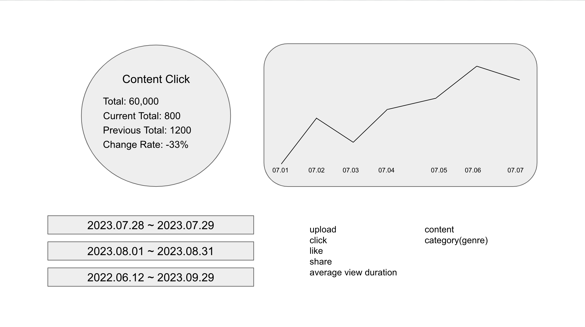

# ELK 스택을 활용해 통계성 데이터 제공하는 API 구현하기

# 0. 목차

-> [요구조건 분석](#1-요구조건-분석)
-> [기술 선택](#2-기술-분석)
-> [마주친 어려움과 해결책](#3-구현-과정에서-마주친-어려움)

# 1. 요구조건 분석

## 1.1. 서비스 개요

SNS 와 같이 많은 사람들이 컨텐츠를 즐기며 서로 상호작용 하는 커뮤니티형 서비스라고 생각해보자.
(예시) 유튜브, 페이스북, 인스타그램

여기에는 크게 세 종류 이상의 도메인이 있다.
(1) 컨텐츠 - content
(2) 컨텐츠를 업로드하는 사용자 - uploader
(3) 컨텐츠를 즐기느 사용자 - viewer or visitor

### 1.2. Analytics API 요구조건

### 1.2.1. Page 1 - 사용자 관련 통계 정보

사용자 관련해서 다음과 같은 요구사항이 있다고 가정해보자.


(1) 통계 정보를 확인하려는 기간을 설정할 수 있다.

-> 시작 시점
-> 종료 시점
-> 조회 범위는 최대 1년으로 한정
-> 데이터는 사용자가 존재하는 timezone 기준으로 보여줘야 한다.

(2) 사용자 방문에 대한 통계 정보를 숫자로 확인하는 경우

다음과 같은 정보가 필요하다.

-> 총 방문자 수 (total)
-> 현재 기간 내 총 방문자 수 (current total)
-> 이전 기간 내 총 방문자 수 (previous total)
-> 방문자 수 증감률 (change rate)

(3) 사용자 방문에 대한 통계 추이를 차트(그래프)로 확인하는 경우

다음과 같은 정보가 필요하다.

-> 단위시간 별 방문자 수

(4) 사용자 관련해서는 다음과 같은 메트릭이 필요하다

기본적인 사용자 관련 메트릭은 다음과 같은 항목이 있다.

-> 활성 사용자 수 (active user)
-> 지역, 성별, 연령에 따른 사용자 수
-> 신규, 휴면, 탈퇴 사용자 수
-> 체험판 / 무료 / 구독 사용자 수

복잡한 사용자 관련 메트릭은 다음과 같은 항목이 있다.

-> 중복없는 사용자 수 (unique user)
-> 첫 페이지 이탈률 (bounce rate)
-> 재방문율 (retention)
-> 평균 방문 페이지 수 (average page view)
-> 평균 페이지에 머무른 시간 (average page duration)

### 1.2.2. Page 2 - 컨텐츠 관련 통계 정보

컨텐츠 관련홰서 다음과 같은 요구사항이 있다고 가정해보자.



(1) 통계 정보를 확인하려는 기간을 설정할 수 있다.

-> 시작 시점
-> 종료 시점
-> 조회 범위는 최대 1년으로 한정
-> 데이터는 사용자가 존재하는 timezone 기준으로 보여줘야 한다.

(2) 컨텐츠 조회수 통계 정보를 숫자로 확인하는 경우

-> 총 조회수 (total)
-> 현재 기간 내 총 조회수 (current total)
-> 이전 기간 내 총 조회수 (previous total)
-> 조회수 증감률 (change rate)

(3) 컨텐츠 조회수 통계 추이를 차트(그래프)로 확인하는 경우

-> 단위시간 별 컨텐츠 조회수

(4) 컨텐츠 관련해서 다음과 같은 메트릭이 필요하다.

기본적인 컨텐츠 관련 메트릭은 다음과 같은 항목이 있다.

-> 업로드 수
-> 조회수
-> 좋아요 수
-> 공유 횟수
-> 평균 시청 시간

컨텐츠 관련 메트릭은 다음 두 가지 항목에 대해서 수집해야 한다.

-> 컨텐츠 마다의 통계 정보
-> 카테고리 별 통계 정보

# 2. 기술 분석

## 2.1. ELK(Elasticsearch, Logstash, Kibana) 를 선택한 이유

처음에는 과거부터 데이터 분석 플랫폼으로 유명한 Hadoop, Spark 를 고려하기도 했지만 결국에는 Elasticsearch, LogStash, Kibana 를 선택헀다.

링크 1 - https://thecustomizewindows.com/2017/02/apache-hadoop-spark-vs-elasticsearch-elk-stack/

[ 이유 1 ]
분석 통계 서비스를 구현해야하는 서비스의 백엔드 메인언어가 NodeJS 인데
Hadoop-Spark 진영에서는 NodeJS Native API 를 제공하지 않고 있기 때문에
NodeJS 에서 사용하기에 보다 편리한 ELK 를 선택한다.

[ 이유 2 ]
Hadoop-Spark 에서 데이터를 저장하는 방식은 Wide-Column Database 이고
Elasticsearch 는 상대적으로 효율적인 Full-Text Search 가 가능한 Search Engine 이다.

[ 이유 3 ]
제공하려는 서비스가 Big Data Processing 자체에 목적이 있다기 보다는
Analytics, Visualization 쪽에 가깝기 때문에
이쪽으로 계속해서 연구개발하고 있는 ELK 를 선택한다.

두 번째 이유에서 등장하는 Wide Column Database 에 대해서 간단하게 살펴보자

링크 1 - https://blog.logrocket.com/nosql-wide-column-stores-guide/
링크 1 - https://www.youtube.com/watch?v=8KGVFB3kVHQ
링크 1 - https://www.youtube.com/watch?v=Vw1fCeD06YI

저장하려는 데이터는 다음과 같다.

| Row Key | id | first_name | last_name | ssn | salary | dob | title | joined |
|--------|----|------------|-----------|-----|--------|-----|-------|--------|
| 1001   | 1  | John       | Smith     | 111 | 101,000 | 1991-01-01 | eng | 2011-01-01 |
| 1002   | 2  | Kary       | White     | 222 | 102,000 | 1992-02-02 | mgr | 2012-02-01 |
| 1003   | 3  | Norman     | Freeman   | 333 | 103,000 | 1993-03-03 | mkt | 2013-03-01 |
| 1004   | 4  | Noel       | Smithson  | 444 | 104,000 | 1994-04-04 | adm | 2014-04-01 |
| 1005   | 5  | Dar        | Sol       | 555 | 105,000 | 1995-05-05 | adm | 2015-05-01 |
| 1006   | 6  | Yan        | Thee      | 666 | 106,000 | 1996-06-06 | mkt | 2016-06-01 |
| 1007   | 7  | Hasan      | Ali       | 777 | 107,000 | 1997-07-07 | acc | 2017-07-01 |
| 1008   | 8  | Ali        | Bilal     | 888 | 108,000 | 1998-08-08 | acc | 2018-08-01 |

### 2.1.1. Row-Oriented Database

RDBMS 에서 위의 데이터를 디스크에 저장하는 방식은 다음과 같다.

```text
1001, 1, John, Smith, 111, 101000, 1991-01-01, eng, 2011-01-01 |||
1002, 2, Kary, White, 222, 102000, 1992-02-02, mgr, 2012-02-01
```
```text
1003, 3, Norman, Freeman, 333, 103000, 1993-03-03, mkt, 2013-03-01 |||
1004, 4, Noel, Smithson, 444, 104000, 1994-04-04, adm, 2014-04-01
```
```text
1005, 5, Dar, Sol, 555, 105000, 1995-05-05, adm, 2015-05-01 |||
1006, 6, Yan, Thee, 666, 106000, 1996-06-06, mkt, 2016-06-01
```
```text
1007, 7, Hasan, Ali, 777, 107000, 1997-07-07, acc, 2017-07-01 |||
1008, 8, Ali, Bilal, 888, 108000, 1998-08-08, acc, 2018-08-01
```

[1] RDBMS 에서 다음과 같은 select 쿼리를 실행한다고 가정해보자.

```sql
SELECT first_name from EMPLOYEE where ssn = 666;
```

디스크에서 조건에 맞는 데이터를 찾아가는 방식은 다음과 같다.

```text
데이터 확인

1001, 1, John, Smith, 111, 101000, 1991-01-01, eng, 2011-01-01 |||
1002, 2, Kary, White, 222, 102000, 1992-02-02, mgr, 2012-02-01

여기에 없음 통과
다음 데이터 확인

1003, 3, Norman, Freeman, 333, 103000, 1993-03-03, mkt, 2013-03-01 |||
1004, 4, Noel, Smithson, 444, 104000, 1994-04-04, adm, 2014-04-01

여기에 없음 통과
다음 데이터 확인

1005, 5, Dar, Sol, 555, 105000, 1995-05-05, adm, 2015-05-01 |||
1006, 6, Yan, Thee, 666, 106000, 1996-06-06, mkt, 2016-06-01

여기에서 찾음 - 완료!
```

[2] RDBMS 에서 다음과 같은 select 쿼리를 실행한다고 가정해보자.

```sql
SELECT * from EMPLOYEE where id = 3;
```

디스크에서 조건에 맞는 데이터를 찾아가는 방식은 다음과 같다.

```text
데이터 확인

1001, 1, John, Smith, 111, 101000, 1991-01-01, eng, 2011-01-01 |||
1002, 2, Kary, White, 222, 102000, 1992-02-02, mgr, 2012-02-01

여기에 없음 통과
다음 데이터 확인

1003, 3, Norman, Freeman, 333, 103000, 1993-03-03, mkt, 2013-03-01 |||
1004, 4, Noel, Smithson, 444, 104000, 1994-04-04, adm, 2014-04-01

여기에서 찾음 - 완료!
```

[3] RDBMS 에서 다음과 같은 aggregate 쿼리를 실행한다고 가정해보자.

```sql
SELECT SUM(salary) from EMPLOYEE;
```

결과값을 응답하기 위해서 다음과 같은 과정을 거친다.

```text
데이터 확인

1001, 1, John, Smith, 111, 101000, 1991-01-01, eng, 2011-01-01 |||
1002, 2, Kary, White, 222, 102000, 1992-02-02, mgr, 2012-02-01

여기에서 salary 값 101000, 102000 확인 완료
다음 데이터 확인

1003, 3, Norman, Freeman, 333, 103000, 1993-03-03, mkt, 2013-03-01 |||
1004, 4, Noel, Smithson, 444, 104000, 1994-04-04, adm, 2014-04-01

여기에서 salary 값 103000, 104000 확인 완료
다음 데이터 확인

1005, 5, Dar, Sol, 555, 105000, 1995-05-05, adm, 2015-05-01 |||
1006, 6, Yan, Thee, 666, 106000, 1996-06-06, mkt, 2016-06-01

여기에서 salary 값 105000, 106000 확인 완료
다음 데이터 확인

1007, 7, Hasan, Ali, 777, 107000, 1997-07-07, acc, 2017-07-01 |||
1008, 8, Ali, Bilal, 888, 108000, 1998-08-08, acc, 2018-08-01

여기에서 salary 값 107000, 108000 확인 완료
마지막 데이터에 도달 - 완료!
```

RDBMS 에서는 성능 향상을 위해서
캐시 설정, 인덱스 설정, Materialized View 사용 등의 전략을 채택할 수 있다.

**Materialized View** 에 대한 설명

링크 1 - https://docs.snowflake.com/en/user-guide/views-materialized
링크 1 - https://materialize.com/blog/why-use-a-materialized-view/
링크 1 - https://www.youtube.com/watch?v=kHLIDnA5x3g

특정한 쿼리의 실행 결과를 미리 저장해둘 수 있는 방법이다. 특정한 쿼리에 대한 일종의 캐시 역할을 한다.
다음과 같은 조건에서 Materialized View 사용을 고려해보면 좋다.

* base table 과 비교했을때 쿼리 결과가 아주 적은 수의 row 만 포함하는 경우
* 쿼리 결과를 얻어내기 위해서 복잡한 연산을 거쳐야 한다거나 높은 부하를 요구하는 경우 (예시, aggregation)
* base table 이 변화가 적은 경우에

Materialized View 테이블에 대해서 얼만큼의 주기로 refresh 를 실행할지 고민이 필요하다.
base table 에 저장한 데이터에 UPDATE 가 자주 일어난다면 View 사용을 권장한다.

### 2.1.2. Column-Oriented Database

Column-Oriented NoSQL Database 에서는 아까 위에서 본 데이터를 다음과 같은 방식으로 저장한다.

```text
1:1001, 2:1002, 3:1003, 4:1004, 5:1005, 6:1006, 7:1007, 8:1008
```
```text
John:1001, Kary: 1002, Norman:1003, Noel:1004, Dar:1005, Yan:1006, Hasan:1007, Ali:1008
```
```text
Smith:1001, White:1002, Freeman:1003, Sol:1004, Thee:1005, Sol:1006, Ali:1007, Bilal:1008
```
```text
111:1001, 222:10002, 333:1003, 444:1004, 555:1005, 666:1006, 777:1007, 888:1008
```
```text
101000:1001, 102000:1002, 103000:10003, 104000:1004, 105000:1005, 106000:10006, 107000:1007, 108000:10800
```
```text
1991-01-01:1001, 1992-02-02:1002, 1993-03-03:1003, 1994-04-04:1004, 1995-05-05:1005,
1996-06-06:1006, 1997-07-07:1007, 1998-08-08:1008
```
```text
eng:1001, mgr:1002, mkt:1003, adm:1004, adm:1005, mkt:1006, acc:1007, acc:1008
```
```text
2011-01-01:1001, 2012-02-01:1002, 2013-03-01:1003, 2014-04-01:1004, 2015-05-01:1005,
2016-06-01:1006, 2017-07-01:1007, 2018-08-01:1008
```

[1] Column-Oriented Database 에서 다음과 같은 select 쿼리를 실행한다고 가정해보자.

```sql
SELECT first_name from EMPLOYEE where ssn = 666;
```

디스크에서 조건에 맞는 데이터를 찾아가는 방식은 다음과 같다.

```text
데이터 확인

111:1001, 222:10002, 333:1003, 444:1004, 555:1005, 666:1006, 777:1007, 888:1008

여기에서 찾음 - Row Key 는 1006
first_name 데이터 확인

John:1001, Kary: 1002, Norman:1003, Noel:1004, Dar:1005, Yan:1006, Hasan:1007, Ali:1008

여기에서 찾음 - 완료!
```

[2] Column-Oriented Database 에서 다음과 같은 aggregate 쿼리를 실행한다고 가정해보자.

```sql
SELECT * from EMPLOYEE where id = 3;
```

디스크에서 조건에 맞는 데이터를 찾아가는 방식은 다음과 같다.

```text
데이터 확인

1:1001, 2:1002, 3:1003, 4:1004, 5:1005, 6:1006, 7:1007, 8:1008

여기에서 찾음 - Row Key 는 1003
나머지 데이터 확인

John:1001, Kary: 1002, Norman:1003, Noel:1004, Dar:1005, Yan:1006, Hasan:1007, Ali:1008

Smith:1001, White:1002, Freeman:1003, Sol:1004, Thee:1005, Sol:1006, Ali:1007, Bilal:1008

111:1001, 222:10002, 333:1003, 444:1004, 555:1005, 666:1006, 777:1007, 888:1008

101000:1001, 102000:1002, 103000:10003, 104000:1004, 105000:1005, 106000:10006, 107000:1007, 108000:10800

1991-01-01:1001, 1992-02-02:1002, 1993-03-03:1003, 1994-04-04:1004, 1995-05-05:1005,
1996-06-06:1006, 1997-07-07:1007, 1998-08-08:1008

eng:1001, mgr:1002, mkt:1003, adm:1004, adm:1005, mkt:1006, acc:1007, acc:1008

2011-01-01:1001, 2012-02-01:1002, 2013-03-01:1003, 2014-04-01:1004, 2015-05-01:1005,
2016-06-01:1006, 2017-07-01:1007, 2018-08-01:1008

각 column 마다 Row Key 가 1003 인 데이터 찾음 - 완료!
```

[3] Column-Oriented Database 에서 다음과 같은 aggregate 쿼리를 실행한다고 가정해보자.

```sql
SELECT SUM(salary) from EMPLOYEE;
```

결과값을 응답하기 위해서 다음과 같은 과정을 거친다.

```text
데이터 확인

101000:1001, 102000:1002, 103000:10003, 104000:1004, 105000:1005, 106000:10006, 107000:1007, 108000:10800

모든 salary 값 확인 - 완료!
```

Column-Oriented Database 에서는 성능 향상을 위해서
캐시 설정, 인덱스 설정, Column Family 사용 등의 전략을 채택할 수 있다.

**Column Family** 에 대한 설명

링크 1 - https://blog.logrocket.com/nosql-wide-column-stores-guide/


Column-Oriented Database 에서 가장 이슈가 되는 것은 여러개의 컬럼에 걸쳐서 쿼리를 실행하는 경우이다.
이를 위해서 여러개의 컬럼을 하나의 도큐먼트 또는 하나의 그룹으로 관리할 수 있도록 하는 전략이다.

하나의 row key 에 대해서 여러개의 column 을 묶어서 한번에 디스크에 저장하면
여러개의 컬럼에 걸쳐있는 쿼리를 효율적으로 처리할 수 있다.

### 2.1.3. 두 가지 한 눈에 비교하기

| Row-Oriented | Column-Oriented |
|--------------------------------------------|--------------------------------------------|
| Optimal for read/write                     | Writes are slower                          |
| OLTP (Online Transactional Processing)     | OLAP (Online Analytical Processing)        |
| Compression isn't efficient                | Compress greatly                           |
| Aggregation isn't efficient                | Amazing for aggregation                    |
| Appropriate for queries with multi-columns | Inefficient queries with multi-columns     |

## 2.2. ELK(Elasticsearch, Logstash, Kibana) 스택

### 2.2.1. Logstash 와 Beats

#### 2.2.1.1. Logstash


Logstash 는 크게 보아서 input - filter - output 세 단계로 동작한다.
logstash 를 실행하는 가장 간단한 명령어는 다음과 같다.

```bash
bin/logstash -e 'input { stdin { } } output { stdout {} }'
```

input, output 은 반드시 명시해야 하고 filter 는 필요한 경우에 지정하면 된다.

input 으로 가능한 항목은 beats, file, syslog, redis, kafka, http, tcp, udp, websocket 등등 아주 다양하다
링크 1 - https://www.elastic.co/guide/en/logstash/current/input-plugins.html

filter 로 가능한 항목은 다음과 같다.
-> age: 현재 timestamp 와 이벤트 timestamp 간의 차
-> drop: 이벤트 무시하기
-> cidr, geoip: ip 정보 분석 및 추가
-> grok: 일정한 규칙에 따라서 비정규화된 문자열을 정규화된 필드로 매핑하기
-> json: JSON 형식의 문자열 파싱하기
-> kv: 키-밸유 형식의 문자열 파싱하기
-> mutate: 데이터 수정(transform)
-> prune: 블랙리스트와 대조 후 drop
-> throttle
-> truncate: 일정한 길이 이상은 잘라내기
링크 1 - https://www.elastic.co/guide/en/logstash/current/filter-plugins.html

output 으로 가능한 항목은 elasticsearch, file, graphite, statsd, cloudwatch, datadog, email, http, s3, mongodb 등등 아주 다양하다.
링크 1 - https://www.elastic.co/guide/en/logstash/current/output-plugins.html

#### 2.2.1.2. Beats

2015년에 오픈소스 커뮤니티는 Elasticsearch 및 ELK 스택으로 데이터를 경량화해서 전송하는 방법을 연구하기 시작했다.
처음으로 탄생한 것은 네트워크 데이터를 전송하는 Packetbeat 였고
추가적으로 Filebeat, Auditbeat, Metricbeat, Winlogbeat 등을 개발한다.
이후에도 계속해서 다양한 input, output 플러그인이 등장한다.

Beats 를 사용하는 경우 다음과 같은 이점이 생긴다.

[1] 전송하는 데이터를 극도로 경량화할 수 있다.

[2] 전송하려는 데이터가 어떤 형태이든 일정한 형식으로 손쉽게 정제할 수 있다.

세상의 다양한 input, output 은 저마다의 데이터 포맷을 갖는다.
logstash 에서 filter 를 아무리 정교하게 만들더라도 세상의 온갖 데이터를 다루기에는 한계가 있다.
logstash 에 도달하기 전에 logstash 에서 다루기 쉬운 형태로 데이터를 가공한다면
수많은 input source 에서 데이터를 수집하는게 보다 용이해진다.

### 2.2.2. Elasticsearch

Elasticsearch 는 흔히 search engine 이라고 부른다.
토큰 기반의 Full-Text Search 에 최적화된 NoSQL 데이터베이스이다.

#### 2.2.2.1. Precision 과 Recall

true positives, false positives


true negatives, false negatives


precision


recall


precision 을 높이는 상황과 recall 을 높이는 상황
precision 과 recall 사이의 상관관계


링크 1 - https://www.youtube.com/watch?v=CCTgroOcyfM

#### 2.2.2.2. Elasticsearch 가 데이터를 저장하는 방식

Elasticsearch Cluster 내부 구조


다른 타입의 데이터를 저장한다면 그대로 저장하지만
텍스트 타입인 경우에는 Text Analysis 실행 후에 별도의 Inverted Index 에 저장한다.


#### 2.2.2.3. 검색 결과에 보이는 Score

Score 는 어떤 도큐멘트가 특정한 쿼리와 얼마나 연관성 있는지를 보여주는 지표이다.
Score 는 개별 도큐멘트마다의 hit 개수에 따라서 달라진다.

Score 를 계산과 관련해서 등장하는 중요한 두 개의 용어는 단어 빈도(Term Frequency, TF), 역 문서 빈도(Inverse Document Frequency, IDF)이다.

Term Frequency 는 하나의 도큐멘트에서 검색 키워드가 자주 등장할수록 해당 도뮤켄트는 연관성이 높다는 가정에서 출발한다.
예를 들어서 "Elasticsearch" 를 검색한다고 가정해보자.

(1) We will discuss **Elasticsearch** at the next Big Data Conference.
(2) Tuesday the **Elasticsearch** team will gather to answer questions about **Elasticsearch** from people who are interested in **Elasticsearch**.

여기서 (1)번 문장의 TF = 1 이고 (2)번 문장의 TF = 3 이 된다.

Inverse Document Frequency 는 여러개의 도큐멘트에 걸쳐서 등장하는 단어일수록 덜 중요하다는 생각에서 출발한다.

(1) We user Elasticsearch to power **the** search for our website.
(2) **The** developers like Elasticsearch so far.
(3) **The** scoring of documents is calculated by **the** scoring formula.

전체 도큐멘트가 총 세 개라고 가정한다면
이 세 개 중에서 Elasticsearch 를 포함하는 도큐멘트는 (1), (2) 두 개이므로 Elasticsearch 의 IDF = 2 이다.
세 개 중에서 the 라는 단어가 보이는 도큐멘트는 (1), (2), (3) 이므로 the 의 IDF = 3 이 된다.
IDF 관점에서 어떤 단어가 중복해서 등장한다고 하더라도 가중치가 높아지는 것은 아니다.

이렇게 TF, IDF 정보를 바탕으로 특정한 계산 공식에 따라서 score 를 계산하게 되고
이 score 가 Elasticsearch 에서 검색결과의 기본적인 정렬 기준이 된다.

### 2.2.3. Kibana

Kibana 는

...

링크 1 - Better Visualization in Kibana -> https://www.youtube.com/watch?v=g0TQrMv37jM
링크 1 - Visualization Theory and Vega Charts -> https://www.youtube.com/watch?v=9uAKdpBCeuA

# 3. 구현 과정에서 마주친 어려움

## 3.1. 전체적인 흐름

[ 데이터 수집 ]
User 서비스, Content 서비스가 API 수신
-> User 서비스, Content 서비스에서 Logstash 에 이벤트 기반의 로그 데이터 전송
-> Logstash 에서 filter 를 거쳐서 결과적으로 얻어낸 최종 형태로 전달한 데이터를 Elasticsearch 에 저장
-> Elasticsearch 에 저장해뒀던 로그를 1시간 단위로 aggregate 해서 analytics 데이터베이스에 저장

[ API 구현 ]
Analytics 서비스에 API 요청이 발생
-> analytics 데이터베이스에서 쿼리 실행 후 Analytics 서비스에서 응답 형태에 맞춰서 가공

## 3.2. 셋업 과정

요즘에는 배포시에 컨테이너 기술을 사용하는 것이 보편화되어 있는 만큼
개발 과정에서도 Docker 를 사용하면 development, staging, production 환경 간의 호환성을 크게 해치지 않을 수 있다.

**[docker-elk](https://github.com/deviantony/docker-elk) 리포지토리 사용하는 방법**

링크 - https://github.com/deviantony/docker-elk

docker-elk 는 누구든 ELK 를 도커 컨테이너 환경에 손쉽게 구축할 수 있도록
최소한의 configuration 만을 제공하는 git 리포지토리이다.

"Usage" 부분을 잘 읽어보면
```bash
$ docker-compose up setup
$ docker-compose up
```
이렇게 되어 있는데,
반드시 setup 스크립트를 실행해서 ELK 스택에서 사용하는 여러가지 프로그램에 대한 셋업을 진행해야하만 정상적으로 사용할 수 있게 된다.
셋업 과정에서 환경변수를 통해서 주입한 초기 비밀번호를 세팅한다.
플러그인을 추가하거나 삭제하는 경우에는 yaml 파일, conf 파일을 적절하게 수정하면 된다.

## 3.3. Logstash 에 전송할 로그 데이터 형태 결정

event_type: 어떤 종류의 이벤트가 발생했는지 표시하는 필드

## 3.4. Elasticsearch 쿼리로 Aggregation 처리하기

통계 및 분석 관점에서는 (1) Frequency, (2) Latency 가 중요한 판단 기준이 된다.

## 3.5. 사용자 지정 시간 범위가 커지면서 예상되는 서버쪽 부하 증가

ELK 에 적재한 데이터를 시간(hour) 단위로, 일(date) 단위로 데이터베이스(MongoDB)에 마이그레이션 해두기

## 3.6. 시간단위(1 hour), 일단위(1 day)로 데이터를 적재해두는 데이터베이스 스키마 설계

Visitor 영역과 Content 영역에 대한 통계정보는 데이터 수집(aggregation) 방식이 다르다.

### 3.6.1. 사용자(Visitor)에 대한 Analytics

Visitor 에서는 사용자가 기준점은 아니다.
메트릭에 따라서는 사용자 타입을 구분하는 것이 중요할 수도 있지만
사용자 관련 이벤트 전체에 대해서 aggregate 한 결과를 보여주면 된다.

### 3.6.2. 컨텐츠(Content)에 대한 Analytics

Content 에서는 통계 및 분석 기준을 한 가지 이상 추가해야 한다.
컨텐츠마다의 aggregation 실행한 결과가 필요하므로 group by content 를 해야한다.
컨텐츠가 속한 카테고리를 기준으로 aggregation 실행한 결과도 필요하므로 group by category 를 해야한다.

## 3.7. 다중 타임존 지원 요구사항

Date 또는 Timestamp 타입의 컬럼은 쿼리 결과에 timezone 적용된 결과값으로 받아오기

꺾은선그래프로 추이를 나타내는 경우 X 축에는 날짜(1일 초과의 기간인 경우) 또는 시간(1일 이하의 기간인 경우)을 표시해야 한다.
여기서 표시하는 날짜나 시간은 서버의 시간이 아니라 API 를 요청하는 사용자의 로컬 타임존에 맞춰서 표시해야 한다.
그러므로 클라이언트에서는 API 요청시

-> begin: 시간의 처음시간이나 처음날짜 ISO String
-> end: 기간의 마지막시간이나 마지막날짜 ISO String
-> timezone: 로컬타임존(예시 Asia/Seoul)

세 개의 파라미터를 보내기로 했다.
Timestamp 데이터를 다룰때는 ISO String 으로 주고 받는게 골치아픈 이슈들을 줄여준다고 생각했다.
그리고 데이터베이스에 저장할때도 timestamp 필드는 전부 utc 값을 저장한다.

쿼리 작성 시에 `$begin <= timestamp AND timestamp <= $end` 조건에 맞는 쿼리를 작성하지만
맨 마지막에 SELECT 결과에는 파라미터 `$timezone` 에 맞는 시간으로 표시되도록 해야한다.

아래 표를 살펴보자.

| 로컬 시간          | 시간대                | 시간차 | UTC               |
|------------------|---------------------|-------|------------------|
| 2023-08-26 00:00 | Asia/Seoul          | +9    | 2023-08-25 15:00 |
| 2023-08-26 11:00 | America/Log_Angeles | -7    | 2023-08-26 04:00 |
| 2023-08-26 22:00 | Europe/Athens       | +3    | 2023-08-27 01:00 |
| 2023-08-27 09:00 | Africa/Abidjan      | +0    | 2023-08-27 09:00 |

현재 사용자가 한국(Asia/Seoul) 시간대에 있다면
API 요청 시, 데이터베이스 쿼리 시에는 "2023-08-25T15:00:00.000Z" 라는 데이터를 사용하겠지만
HTTP Response 에는 "2023-08-26T00:00:00.000Z" 이라고 표시해야 한다.

데이터베이스마다 timezone 을 적용해서 DateTime 타입의 컬럼을 표기하는 방법을 각자 갖고 있다.

mysql 에서 `Asia/Seoul: +09:00` 시간대에 맞춰서 쿼리를 하려면 아래와 같이 하면 된다.

```sql
SELECT DATE_FORMAT(CONVERT_TZ(timestamp, '+00:00', '+09:00'), '%Y-%mm-%dd %HH:%ii:%ss');
```

postgresql 에서 `Europe/Moscow: +03:00` 시간대에 맞춰서 쿼리를 하려면 아래와 같이 하면 된다.

```sql
SELECT TO_CHAR(
    DATE_TRUNC(
        'day',
        TIMESTAMP WITH TIME ZONE '2023-07-11 13:53:05+00'
    ) AT TIME ZONE 'Europe/Moscow',
    'YYYY-MM-DD HH24:MI:SS'
);
```

mongodb 에서 `America/New_York: -05:00` 시간대에 맞춰서 쿼리를 하면 아래와 같이 하면 된다.

```mongodb
{
    $project: {
        formattedDate: {
            $dateToString: {
                format: '%Y-%m-%d %H-%M-%S',
                date: '$timestamp',
                timezone: 'America/New_York'
            }
        }
    }
}
```

## 3.8. 통계성 API 서버에 장애가 발생했을때 fallback 처리 방식

## 3.9. Analytics 데이터를 다룰때 데이터 보정, 데이터 퀄리티 관리 방식
